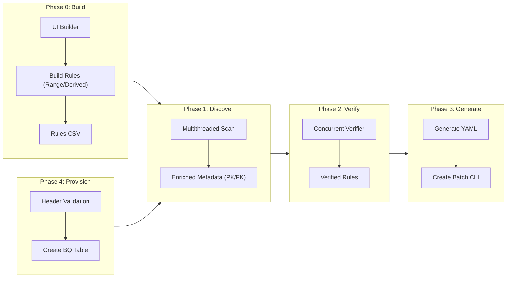

# Dataplex Master Hub Ecosystem 🚀

A modernized, structured ecosystem to automate Google Cloud Dataplex Data Quality Scan creation and BigQuery table provisioning.

## 📊 End-to-End Workflow



## 🌟 Key Features

### **Unified Master Hub (`hub.py`)**
A centralized dashboard to manage the entire data quality lifecycle:
- **Intelligent Connectivity:** Automatic proxy detection and authentication.
- **High-Performance:** Multithreaded execution across discovery, verification, and provisioning.
- **Zero-Lag UI:** Collapsed execution logs to maintain a smooth experience.

### **Advanced Quality Rules**
- **Range Thresholds:** Define specific lower and upper bounds for metrics.
- **Derived Attributes:** Create rules for calculated fields using custom naming patterns.
- **Table-Level Checks:** Support for volume and cross-table validation logic.

### **🏗️ Phase 4: Table Provisioning**
Directly create BigQuery tables with advanced configurations:
- **Validation:** Cross-references data sample headers against schema definitions.
- **Partitioning & Clustering:** Automated setup based on schema flags.
- **Constraints:** Automatic application of Primary Key metadata.

## 📂 Project Structure

- `00_Orchestration/`: Master Hub application and agent definitions.
- `01_Phase_0_Rule_Building/`: UI and CLI for rule creation.
- `Shared_Resources/`: CSV templates and architecture diagrams.
- `outputs/`: Table-specific artifacts (YAML, Bash, Schemas).
- `logs/`: Timestamped audit trails for all operations.

## 🛠️ Getting Started

1.  **Authentication:**
    ```bash
    gcloud auth application-default login
    ```
2.  **Launch the Hub:**
    ```bash
    streamlit run 00_Orchestration/hub.py
    ```
3.  **Templates:** Use `Shared_Resources/table_schema_template.csv` for defining new tables in Phase 4.
