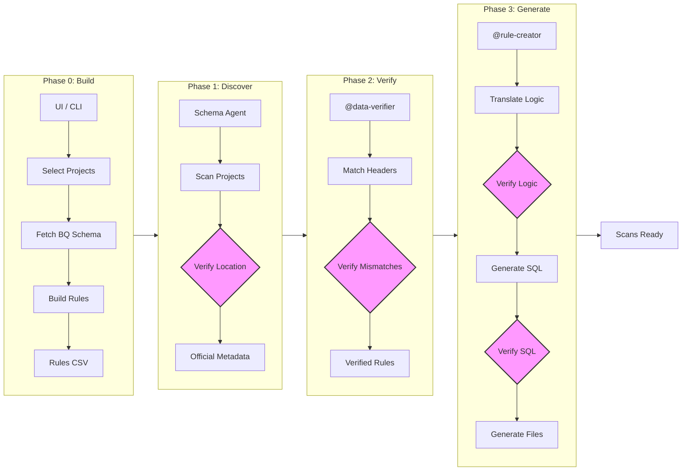

# Dataplex Master Hub Ecosystem 🚀

A modernized, structured ecosystem to automate Google Cloud Dataplex Data Quality Scan creation.

## 📊 End-to-End Workflow



---

## 🏗️ The 4-Phase Pipeline

| Phase | Agent | Folder | Purpose |
| :--- | :--- | :--- | :--- |
| **0** | `@rule-builder` | `01_Phase_0_Rule_Building` | Interactively build rules CSV with live schema fetching. |
| **1** | `@schema-agent` | `02_Phase_1_Schema_Discovery` | Pull ground-truth BigQuery metadata as artifacts. |
| **2** | `@data-verifier` | `03_Phase_2_Metadata_Verification` | Align rules CSV against official BQ metadata. |
| **3** | `@rule-creator` | `04_Phase_3_Config_Generation` | Translate logic to modern 2026 Dataplex YAML/Batch. |

---

## 🛠️ Execution Guide

### **1. Launch the Orchestrator**
The central hub for the entire pipeline:
```powershell
cd 00_Orchestration
streamlit run hub.py
```

### **2. Directory Architecture**
- **`/00_Orchestration`**: Central control hub and orchestrator agent.
- **`/01_Phase_0_Rule_Building`**: Rule building tools and agents.
- **`/02_Phase_1_Schema_Discovery`**: BQ discovery engine.
- **`/03_Phase_2_Metadata_Verification`**: Automated metadata alignment.
- **`/04_Phase_3_Config_Generation`**: Artifact generation.
- **`/Shared_Resources`**: Templates, guides, and shared datasets.
- **`/outputs`**: Table-specific artifacts (Schemas, YAMLs, Batch).
- **`/logs`**: Full execution audit trail.

---

## ✨ System Standards
- **User-Agnostic**: All scripts use dynamic relative pathing.
- **Compliance**: Follows modern 2026 Dataplex `sqlAssertionExpectation` standards.
- **Traceable**: Every action is timestamped and logged.
- **Secure**: Integrated corporate proxy and gcloud auth support.
