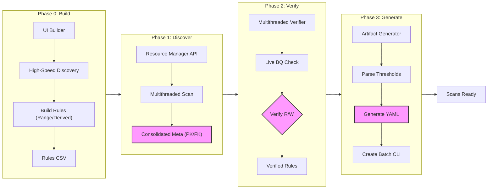

# Dataplex Master Pipeline

This is the centralized hub for the **Dataplex End-to-End Scan Creation System**. 

## **End-to-End Workflow Diagram**

## **The Master Orchestrator**
**Tool:** `hub.py` (Streamlit)
- **Purpose:** A single entry point to run all 5 phases of the pipeline.
- **Features:** Intelligent **"Direct-First, Proxy-Fallback"** networking using the `Shared_Resources/networking.py` utility. Automatically handles corporate proxy settings (`http://googleapis-dev.dev.gcp.cloud.in.hsbc:3128`) and enforces remote DNS resolution to ensure stable connectivity. Unified execution logs are displayed via `Shared_Resources/ui_helpers.py`.

## **The Four-Phase Pipeline**

### **Phase 0: Rule Building (UI)**
**Tool:** `01_Phase_0_Rule_Building/ui_builder.py` (Streamlit)
- **Purpose:** Create your rules file from scratch using a reactive UI. Supports Single pass-rates, Range Thresholds (Lower/Upper), and Derived Attributes.
- **Verification Step:** Live validation using Google APIs. Logs are minimized by default to ensure maximum speed.

### **Phase 1: Discovery (Schema Alignment)**
**Tool:** Built into `hub.py`
- **Purpose:** Perform bulk extractions at the table, dataset, or project level.
- **Features:** Uses Resource Manager APIs for lightning-fast project scans. Identifies Primary Keys, Foreign Keys, Partitioning, and Clustering columns.

### **Phase 2: Verification (Rule Cleansing)**
**Tool:** Built into `hub.py`
- **Purpose:** Cross-reference your Rules File against actual live Data schemas in bulk.
- **Features:** Multithreaded concurrent verification (`ThreadPoolExecutor`). Accurately validates derived attributes and physical columns.

### **Phase 3: Generation (Config Creation)**
**Tool:** Built into `hub.py`
- **Purpose:** Translate verified rules into Dataplex YAML and executable shell scripts (`create_scan.sh`).
- **Features:** Handles range thresholds and automatically skips schema constraints for derived attributes.

---

## **Directory Structure**
- `/00_Orchestration`: Master Hub and unified workflows.
- `/01_Phase_0_Rule_Building`: UI and CLI for rule creation.
- `/02_Phase_1_Schema_Discovery`: Legacy individual discovery agents.
- `/03_Phase_2_Metadata_Verification`: Legacy verification agents.
- `/04_Phase_3_Config_Generation`: Legacy config translation agents.
- `/outputs`: (Automated) Structured artifacts (YAML, Bash, Schemas).
- `/logs`: (Automated) Timestamped audit logs for every execution step.
- `/Shared_Resources`: Master templates and architecture diagrams.